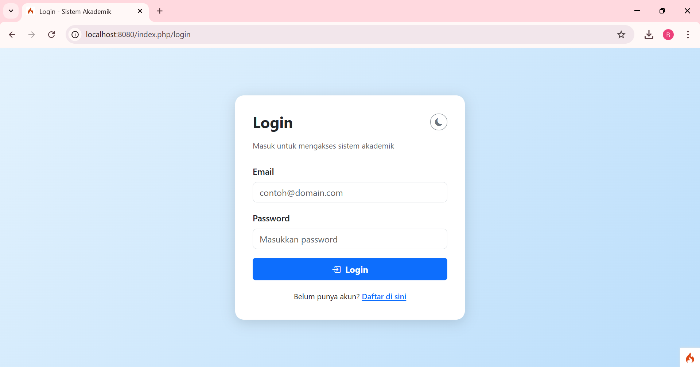
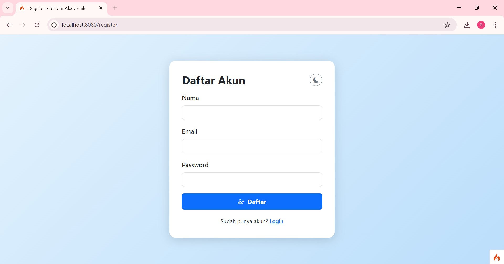
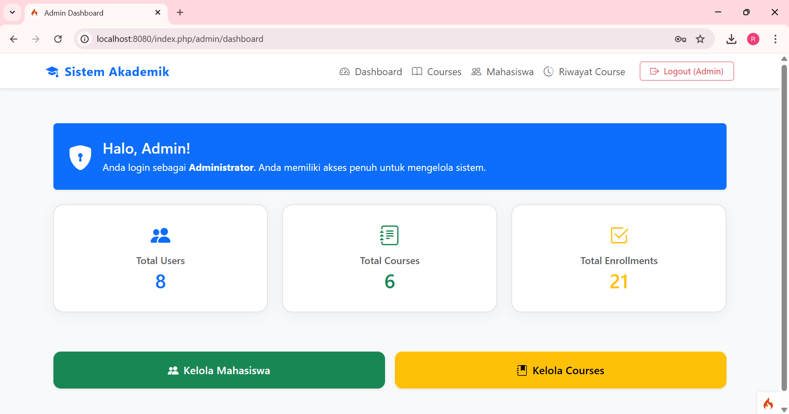

# 🎓 Sistem Akademik Sederhana

Sistem akademik berbasis **CodeIgniter 4** yang mendukung manajemen data mahasiswa dan mata kuliah secara interaktif. Dibangun untuk memenuhi misi pembelajaran *DOM Manipulation* dan *Event Handling* menggunakan **JavaScript**.

## Fitur Utama

### Student

* Daftar mata kuliah (course list), 
* Riwayat Course
* Download PDF (rekap sks)

### Admin

* CRUD Course (Create, Edit, Delete)
* CRUD Mahasiswa / User (Create, Edit, Delete)

---

## Teknologi yang Digunakan

* **CodeIgniter 4** (PHP Framework)
* **PHP 8+**
* **MySQL / MariaDB** (Database)
* **Bootstrap 5 + Bootstrap Icons**
* **JavaScript DOM & Fetch API** (AJAX)
* **FontAwesome / Google Fonts** (untuk ikon & tipografi)

---

## Tampilan Sistem
| Halaman | Preview |
|--------|---------|
| **Halaman Login** |  |
| **Halaman Register** |  |
| **Halaman Admin** |  |
| **Halaman Mahasiswa** |  |

---

## Instalasi

1. Clone repository:
```bash
git clone https://github.com/username/sistem-akademik.git
```
2. Masuk ke folder project & install dependencies:
```bash
composer install
```
3. Duplikat file `.env.example` → `.env`, lalu sesuaikan koneksi database.
4. Migrasi database:
```bash
php spark migrate
```
5. Jalankan server lokal:
```bash
php spark serve
```
6. Akses melalui browser:
```
http://localhost:8080
```