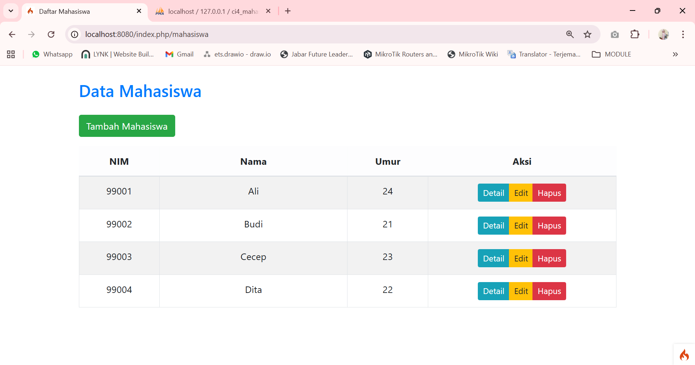
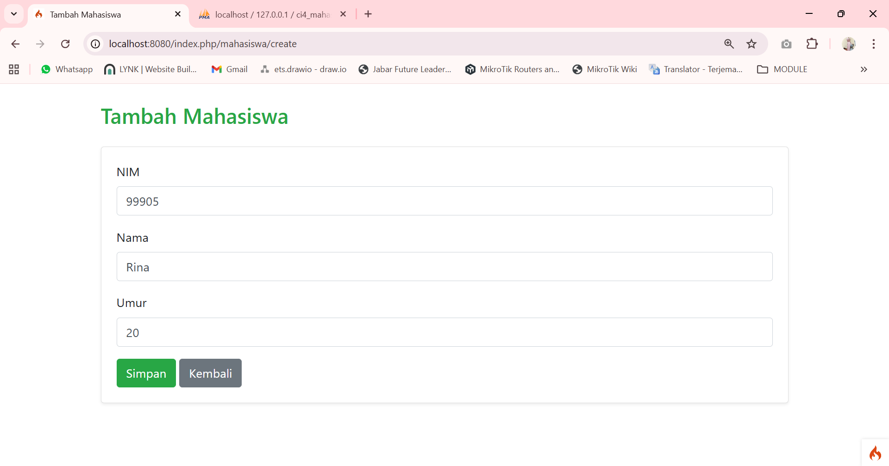
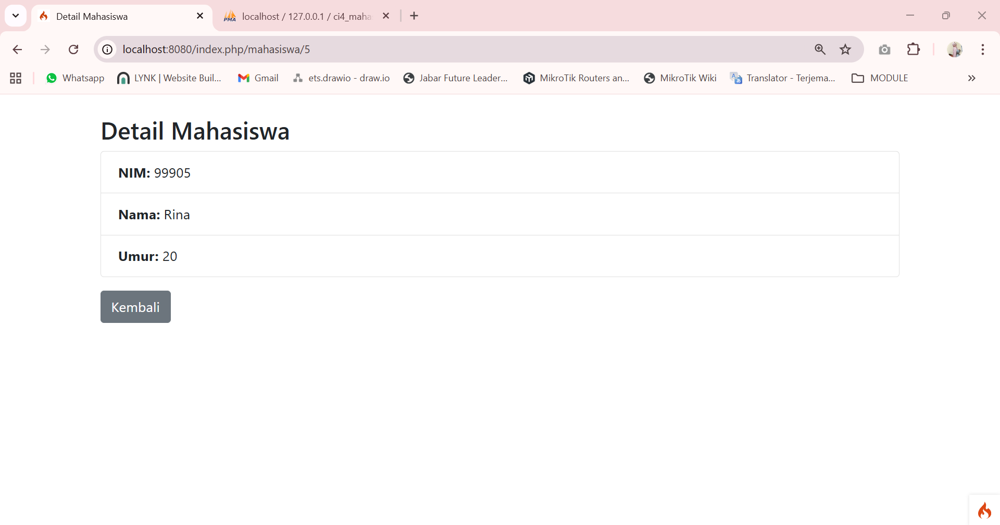
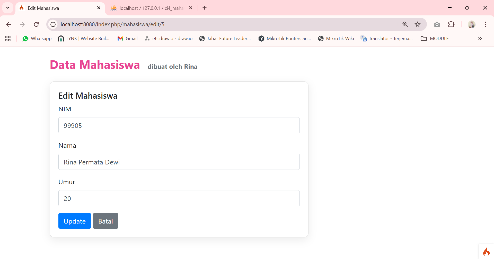
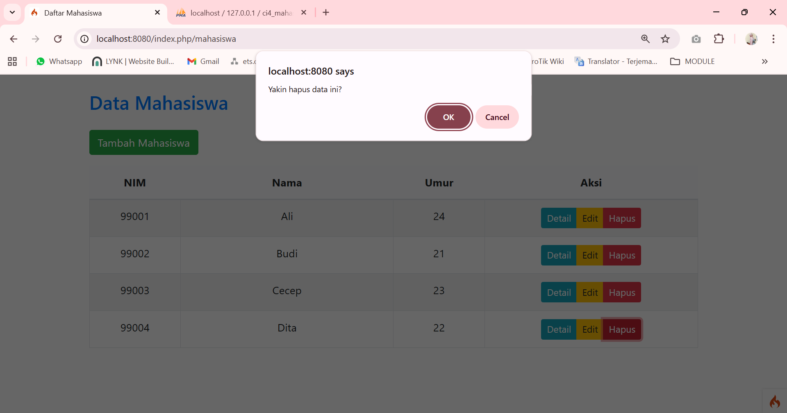

# Project Mahasiswa (CodeIgniter 4)

Project ini merupakan aplikasi sederhana manajemen data mahasiswa menggunakan CodeIgniter 4.

## Fitur
- Login & Logout
- Tampilkan data mahasiswa
- Tambah mahasiswa
- Edit mahasiswa
- Hapus mahasiswa
- Lihat detail mahasiswa

## Tampilan

### 1. Halaman Home

### 2. Form Tambah Mahasiswa

### 3. Aksi Detail, Edit, dan Hapus

---

## Cara Menjalankan
1. Clone repository ini
2. Import database `mahasiswa.sql`
3. Jalankan dengan `php spark serve`
4. Akses di browser `http://localhost:8080`

---

## Dibuat oleh
Rina Permata Dewi
241511061
2B/D3 Teknik Informatika